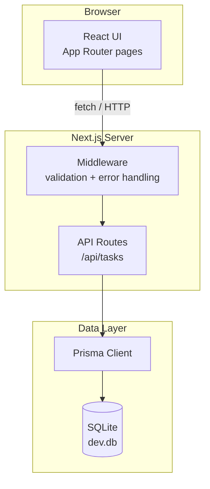

# Architecture

## System overview

The app is a full-stack Next.js application. The frontend (React) and backend (API routes) live in the same project. Prisma talks to a local SQLite database file.

## Architecture diagram



## Layers

### 1. UI layer — `app/` (React components)
Next.js App Router pages and React components. Responsible for rendering the task list, forms, and filter bar. Communicates with the backend exclusively through `fetch()` calls to the API routes.

Key pages:
- `app/page.tsx` — main task dashboard
- `app/tasks/new/page.tsx` — create task form
- `app/tasks/[id]/edit/page.tsx` — edit task form

Key components:
- `components/TaskList.tsx` — renders the list of tasks
- `components/TaskCard.tsx` — individual task row with actions
- `components/TaskForm.tsx` — shared form for create and edit
- `components/FilterBar.tsx` — status and priority filters

### 2. API layer — `app/api/` (Next.js Route Handlers)
REST API endpoints that handle HTTP requests from the frontend. Each route validates the request, calls the Prisma service, and returns JSON.

| Method | Route | Action |
|--------|-------|--------|
| GET | `/api/tasks` | List all tasks (with filters) |
| POST | `/api/tasks` | Create a new task |
| GET | `/api/tasks/[id]` | Get a single task |
| PUT | `/api/tasks/[id]` | Update a task |
| DELETE | `/api/tasks/[id]` | Delete a task |

### 3. Data layer — `lib/` (Prisma + DB)
Prisma ORM manages all database access. The schema defines the Task model. All queries go through the Prisma Client — no raw SQL.

## Data model

```prisma
model Task {
  id          Int       @id @default(autoincrement())
  title       String
  description String?
  priority    Priority  @default(MEDIUM)
  status      Status    @default(ACTIVE)
  dueDate     DateTime?
  label       String?
  createdAt   DateTime  @default(now())
  updatedAt   DateTime  @updatedAt
}

enum Priority {
  LOW
  MEDIUM
  HIGH
}

enum Status {
  ACTIVE
  COMPLETED
}
```

## Folder structure